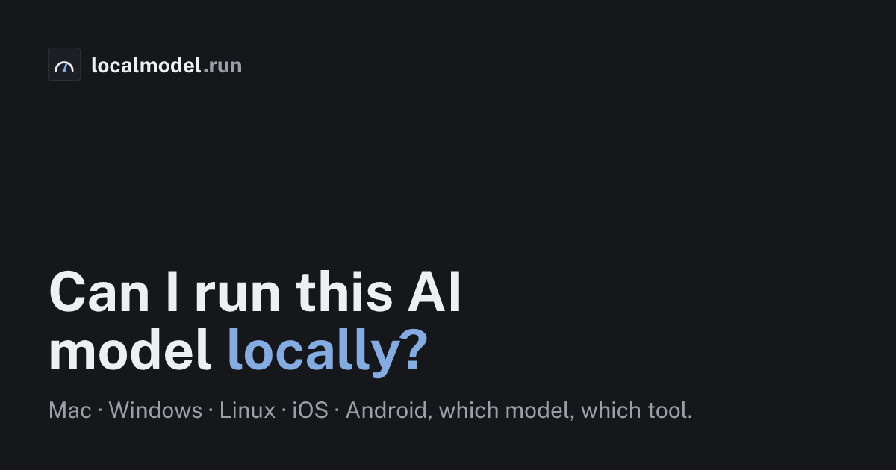

# localmodel.run

[](https://github.com/ansumanshah/localmodel.run/actions/workflows/ci.yml)
[](LICENSE)
[](https://localmodel.run)
[](https://huggingface.co/spaces/ansumanshah/can-i-run-it-locally)
[](https://astro.build)

[](https://localmodel.run)

Can I run this AI model locally? A per-platform compatibility checker for local
AI models. Pick a model and your hardware and get a verdict, the memory math,
the exact tool to use, and what to run instead, across macOS, Windows, Linux,
iOS and Android.

**Live at [localmodel.run](https://localmodel.run).** Free, no account, cookieless.

Every page does its own memory math from measured GGUF sizes and sourced device
specs, statically rendered as one page per model, per device, and per
`model × device` pair. Each number links to its primary source.

## Modalities

153 models across four modalities, each with its own sourced memory model:

- **Text LLMs** (125): Llama, Qwen, DeepSeek, Gemma, Mistral, Phi, GLM, Kimi, and more. Memory = weights at the chosen quant + KV cache + runtime overhead.
- **Image generation** (6): FLUX.1 dev/schnell, SDXL, SD 3.5 Large, Stable Diffusion 1.5, Qwen-Image.
- **Video generation** (11): Wan 2.1/2.2, LTX-Video, CogVideoX, HunyuanVideo, Mochi 1, Stable Video Diffusion.
- **Audio and voice** (11): Whisper (STT), Kokoro / Bark / Dia / Orpheus (TTS), MusicGen / Stable Audio (music).

For diffusion (image/video) the verdict uses a **sourced peak-VRAM-consumed
anchor** at the consumer-default quant, not a naive sum of file sizes: the large
text encoder (T5-XXL, Qwen2.5-VL) is offloaded to CPU after prompt-encoding, so
peak VRAM tracks the backbone, not the total. A **runtime gate** keeps the
verdict honest: a 12B image model has no local runtime on a phone or CPU-only
laptop, so those pairs are not emitted. Audio models report peak memory and
whether they run on CPU.

## Stack

- **Astro 7** (Rolldown), static output, near-zero JS on content pages for Core Web Vitals and crawlability.
- **Tailwind v4** (via `@tailwindcss/vite`) with design tokens in CSS custom properties: matte-panel light default, gunmetal dark, calibration-blue needle accent, inked verdict stamps ("The Calibrated Instrument" design language, see `docs/design-system.md`).
- **React 19 island**, only the interactive hardware detector ships JS.
- **astro-icon** (simple-icons + lucide) for maker, device and OS marks, with lettered-chip fallbacks.
- **Fjalla One + Public Sans + JetBrains Mono** (display / body / data), self-hosted via `@fontsource` (no third-party font CDN).
- **Cloudflare Pages** static hosting + cookieless Cloudflare Web Analytics (no consent banner). See `/privacy`.
- **bun** for install, dev, build and scripts.

## Data

Every numeric value is validated against a primary source, and every row carries
a `sources[]` array that the pages render.

- `src/data/models.json`, text LLMs: params, GGUF quant sizes (Q4_K_M, Q8_0), context, Ollama tag.
- `src/data/image-models.json`, `video-models.json`, `audio-models.json`: backbone params, component sizes, and a sourced peak-VRAM/peak-memory anchor (with its own source URL) per model.
- `src/data/devices.json`, 40 devices: Macs, NVIDIA/AMD GPUs, unified-memory APUs, RAM-only laptops, iPhones/iPads, Android, with sourced usable memory, bandwidth, MSRP and TDP.
- `src/data/tools.json`, per-platform runtime recommendations.
- `src/lib/compute.ts`, the text memory estimator (bits-per-weight, KV cache, MoE-aware, Apple unified-memory handling).
- `src/lib/compute-mm.ts`, the multi-modal engine: dispatches text to `compute.ts` unchanged, and uses the sourced anchors + runtime gate for image/video/audio. See `/methodology`.

`scripts/validate-data.mjs` is a CI gate that fails the build on bad rows and
requires a source URL on every non-text VRAM anchor.

Sources: Ollama library, HuggingFace GGUF repos (bartowski, unsloth, city96,
QuantStack), vendor model cards (Black Forest Labs, Stability, Alibaba, Tencent,
Genmo, Lightricks, OpenAI), the diffusers memory docs, and Apple / NVIDIA / AMD
spec pages.

## Develop

```bash
bun install
bun run dev            # local dev server
bun run build          # static build -> dist/
bun run preview        # preview the build
bun run validate-data  # CI gate: sanity-check the dataset
bun run check          # astro check (type + template diagnostics)
bunx knip              # find unused files, exports and dependencies
```

## Data refresh (cron)

`.github/workflows/update-data.yml` runs weekly, pulls current GGUF sizes from
the Ollama OCI registry and the HuggingFace Hub API (`scripts/update-data.mjs`),
validates, and commits any changes. The push triggers a redeploy.

- Add a `HF_TOKEN` repo secret for higher HuggingFace rate limits (optional).
- Add `hf_repo` to a model row to pull exact per-quant sizes from HuggingFace.

## Deploy (Cloudflare Pages)

Git integration: in the Cloudflare dashboard, create a Pages project from this
repo. Build command `bun run validate-data && bun run build`, output dir `dist`,
set `SITE_URL` to the production origin. `.github/workflows/purge-on-deploy.yml`
purges the edge cache when a deploy completes (needs `CLOUDFLARE_API_TOKEN` with
Cache Purge scope, `CLOUDFLARE_ZONE_ID`).

Optional build-time env vars (Cloudflare Pages → Settings → Environment variables):

- `SITE_URL`, the canonical production origin (defaults to `https://localmodel.run`).
- `CF_BEACON_TOKEN`, the Cloudflare Web Analytics site token. Unset = no analytics script emitted.
- `GSC_VERIFICATION`, optional Google Search Console verification meta tag (backup to DNS TXT).

## SEO + AI-crawlability

- One indexable page per `model × device` (`/can-i-run/[model]/[device]`), per device (`/best-llm-for/[device]`), and per model (`/model/[model]`), plus `/compare` head-to-heads, `/rig-for/[model]`, `/leaderboard` (Aider / BFCL / LMArena with hardware fit), `/best-llm-for-ram/[budget]`, embeddable SVG badges (`/badge/[model]/[device].svg`) and an OpenAPI spec (`/api/openapi.json`); about 6,400 pages.
- JSON-LD on every page: TechArticle, FAQPage, BreadcrumbList, ItemList, Dataset, WebApplication, Organization, WebSite.
- `robots.txt` explicitly allows AI crawlers (GPTBot, ClaudeBot, PerplexityBot, Google-Extended) since being citable is the strategy.
- `/llms.txt` and `/llms-full.txt` expose all 153 models (text, image, video, audio) for answer engines.
- Sitemap, RSS, canonical URLs, OG/Twitter cards (dynamic per page via Satori), fast static HTML.

## License and reusing the data

- **Code:** MIT ([LICENSE](LICENSE)).
- **Data:** the dataset under `src/data/` (every row carries its `sources[]`) is
  also available under CC BY 4.0 ([LICENSE-DATA](LICENSE-DATA)), and mirrored as a
  [HuggingFace dataset](https://huggingface.co/datasets/ansumanshah/local-ai-model-memory-requirements).
  Use it in your app, benchmark, paper or README; credit it with a link:

  ```md
  Data: [localmodel.run](https://localmodel.run) (CC BY 4.0)
  ```

- **Badges:** every `model × device` pair has an embeddable SVG badge for GGUF
  model cards and project READMEs:

  ```md
  [](https://localmodel.run/can-i-run/llama-3.1-8b/apple-m4-16gb)
  ```
